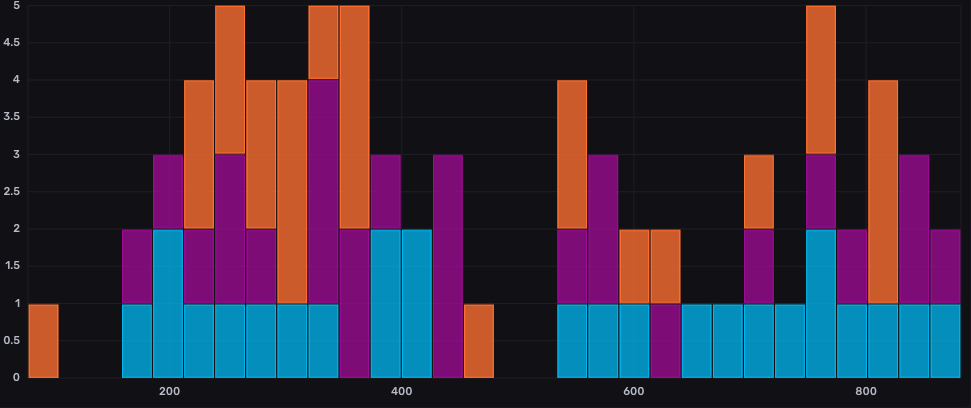

# Network Monitor

## Overview

Network Monitor is a Go-based tool for capturing and analysing network traffic, designed for efficiency and compatibility with various platforms, including PCs or Raspberry Pi. It utilises InfluxDB for storing network metrics, providing insights into network performance and health.

## Features

- **Comprehensive Packet Capture**: Logs every packet, detailing size, source, destination, and protocol.
- **Performance Metrics**: Measures latency, jitter, and packet loss to assess network health.
- **Data Aggregation and Visualisation**: Stores metrics in InfluxDB, supporting complex analyses and visualisations with tools like Grafana or directly through the InfluxDB dashboards themselves.



## Deployment

Network Monitor can be run on any computer or a Raspberry Pi, requiring minimal setup.

### Prerequisites

- A computer or Raspberry Pi with network access.
- Docker installed for running InfluxDB in a container.
- Go installed for running the Network Monitor application.

### Setting Up InfluxDB

InfluxDB is used to store and manage the network metrics captured by Network Monitor. It runs in a Docker container, simplifying deployment and management.

1. Ensure Docker is installed and running on your system.
2. Use the provided `docker-compose.yml` file to launch InfluxDB:

   ```bash
   docker-compose up -d influxdb
   ```

### Configuration

Before running Network Monitor, configure the connection to InfluxDB through an environment file (`.env`), which is not included in the repository for security reasons. Create this file with the following contents:

```plaintext
INFLUXDB_URL=YourInfluxDBURL #e.g. http://localhost:8086
INFLUXDB_ADMIN_TOKEN=YourInfluxDBToken
INFLUXDB_ORG=YourOrganisation
INFLUXDB_BUCKET=YourBucket
```

Replace `YourInfluxDBToken`, `YourOrganisation`, and `YourBucket` with your actual InfluxDB credentials and configuration.

## Running Network Monitor

Use the provided script `run.sh` to build and run the Network Monitor application. Ensure the `.env` file is in the same directory as `run.sh` for the application to read and use the InfluxDB configuration.

```bash
./run.sh
```

This script builds the Go application and starts capturing network metrics, sending them to InfluxDB.

## Conclusion

Network Monitor, with its detailed packet capturing and integration with InfluxDB, offers a powerful and flexible solution for monitoring network performance and health. Its ability to capture all packets, along with their size and protocol, opens up possibilities for in-depth network analysis and visualisation. Whether you're looking to troubleshoot network issues, optimise performance, or simply gain a better understanding of your network traffic, Network Monitor provides the tools and data you need to achieve your goals.
